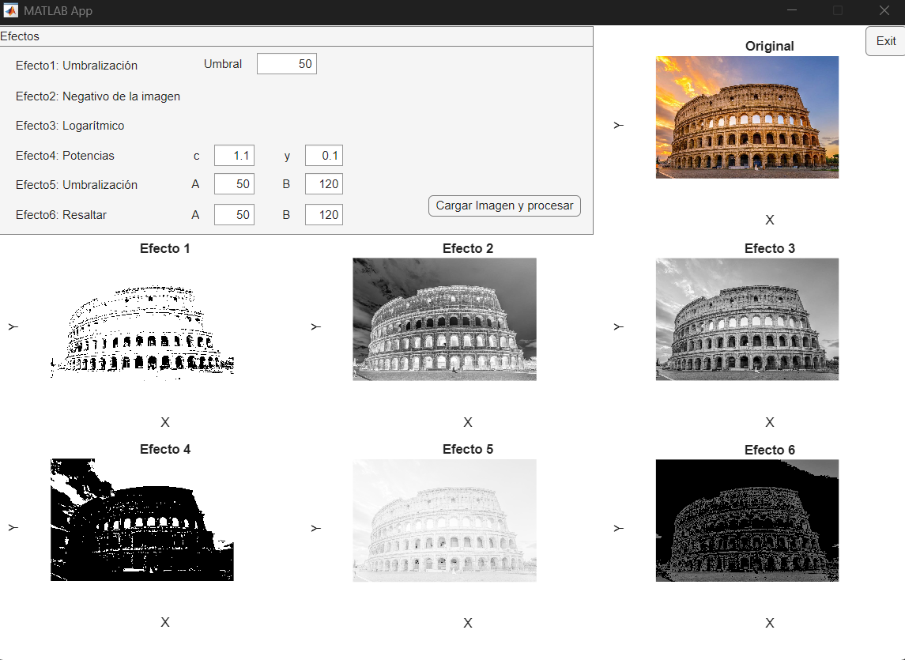

MATLAB ImageFX
==============

MATLAB ImageFX es una herramienta visual e interactiva desarrollada con App Designer para aplicar transformaciones básicas sobre imágenes en escala de grises. Convierte automáticamente imágenes en color a grises y permite experimentar con umbrales, transformaciones punto a punto y resaltado por rangos.

🎯 Características
------------------

- ✅ Carga imágenes en color o escala de grises (rechaza imágenes grises sin información de color).
- 🎨 Convierte automáticamente a escala de grises para su procesamiento.
- 🧮 Aplica 6 efectos clásicos de procesamiento de imagen:
  1. Umbral simple
  2. Negativo
  3. Transformación logarítmica (c·log(1 + r))
  4. Transformación potencia (c·r^y)
  5. Umbralización doble entre A y B
  6. Resaltado de zona entre A y B (manteniendo tonos originales)

Las capturas se encuentran en la carpeta `ss/`.

<p align="center">
  
</p>

📁 Estructura del proyecto
--------------------------
```
MATLAB-ImageFX/
├── app.mlapp              # Aplicación principal en App Designer
├── app_exported.m         # Versión exportada en script
├── img-test/              # Carpeta con imágenes de prueba (BMP, JPG)
│   ├── img-1.bmp
│   ├── img-1_1.bmp
│   ├── img-3.jpg
│   └── img-3_1.jpg
├── ss/                    # Screenshots de ejemplo
│   └── ss.png
└── README.md              # Este archivo
```

🚀 Cómo ejecutar
----------------

Opción 1: Desde App Designer
1. Abre `app.mlapp` en App Designer.
2. Haz clic en Run ▶️.
3. Haz clic en el botón "Cargar y procesar imagen".

Opción 2: Desde consola MATLAB (modo script)
1. Abre MATLAB en la carpeta del proyecto.
2. Ejecuta:

    main

O directamente:

    efectos_imagen('img-test/img-3.jpg');

⚙️ Valores por defecto
----------------------

La app usa estos valores si el usuario no los modifica:

    umbral = 50;
    c = 1.1;
    y = 0.1;
    A = 120;
    B = 150;

📌 Notas
--------

- Si cargas una imagen en escala de grises (1 canal) o visualmente gris (RGB con R=G=B), se mostrará una advertencia y no se procesará.
- Los efectos están organizados en 7 ejes (UIAxes) y un solo botón activa todo el procesamiento.
- Ideal para enseñanza de procesamiento de imágenes en cursos básicos o intermedios.

📜 Licencia
-----------

MIT License. Puedes usar, modificar y compartir este proyecto libremente.
